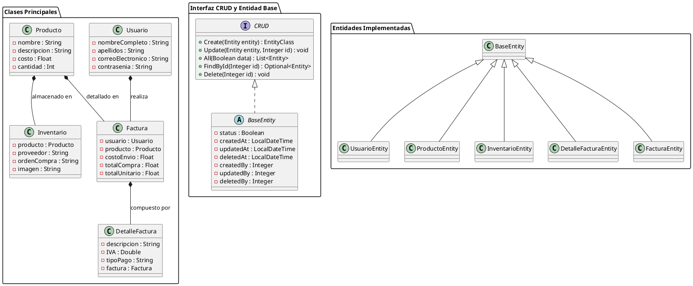
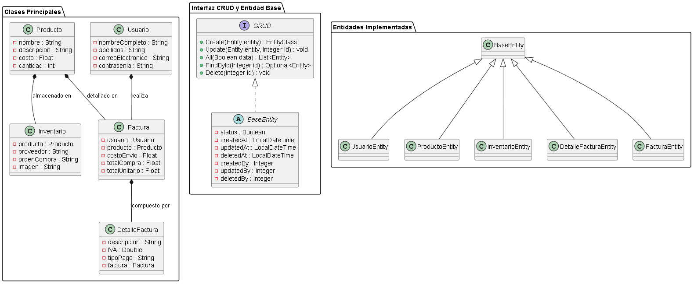

# Diagrama de clase

## Integrantes:
- Juan Esteban Alvarez Arciniegas
- Danna Michelle Morales Losada

## Descripcion general:

- Este proyecto implementa una base de datos para un sistema de carrito de compras que gestiona roles de Administrador y Comprador. Incluye funcionalidades como registro y autenticación de usuarios, administración de productos en inventario, y generación de facturas detalladas para cada compra. La estructura del sistema se organiza en torno a entidades clave, que incluyen Usuario, Producto, Inventario, Factura, y DetalleFactura. Este diseño permite realizar consultas y relaciones entre varias entidades, mejorando la funcionalidad y gestión de datos en el sistema de compras.

## Código WSD

## Diagrama 

